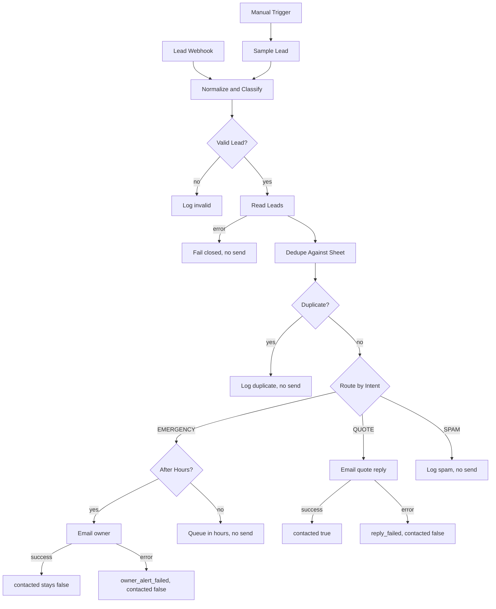

# Demo A — Lead response router

**Workflow name:** `CKA Demo — Lead Response Router`
**File:** [`cka-lead-response.workflow.json`](cka-lead-response.workflow.json)
**Status:** inactive portfolio demo. Fake data only. Not a live client system.

Fictional shop used in the sample email copy: **Northwind Home Services**.

## Resume one-liner

> Built an n8n lead-response router that classifies inbound leads (emergency, quote, or spam), applies business-hours routing and 24-hour dedupe, logs every lead to Google Sheets, and marks a lead contacted only after a successful send.

There is no hosted demo URL. Import the JSON, leave it inactive, then use the **Manual Trigger** or a local webhook-test listen. The localhost curl example below is the supported test path.

## Problem

A service business loses after-hours emergencies and wastes replies on spam. The useful behavior is small and strict:

- Emergencies that arrive outside business hours alert the owner. The customer is not auto-replied.
- Emergencies during business hours are logged for the person already on shift. No automatic email.
- Quote requests get one polite acknowledgement.
- Spam is stored and never replied to.
- The same person sending the same message again within 24 hours does not get a second email.
- A failed send must not leave the lead looking contacted.

## Architecture

Classification is **rule-based**. There is no LLM node, so the workflow runs without an OpenAI key. The rules live in [`lib/lead-rules.js`](lib/lead-rules.js) and are copied into the Code nodes.

Order, first match wins:

1. **SPAM** — sales and junk phrases (`guest post`, `crypto`, `click here`, `limited time offer`, …).
2. **EMERGENCY** — safety and outage phrases (`flood`, `gas smell`, `no heat`, `burst`, …).
3. **QUOTE** — pricing and scheduling phrases (`quote`, `estimate`, `how much`, …).
4. Anything else that is still a valid lead defaults to **QUOTE**, with `intent_rule = default_quote_no_keyword`, so a real person is not ignored. Spam is the only silent class besides duplicates and invalid payloads.

Business hours are Monday–Friday, **08:00 inclusive through 17:00 exclusive**, `America/Chicago`. The Code node computes this itself. It does not depend on the n8n instance timezone, though the workflow timezone is also set to `America/Chicago`.

`demo_received_at` (ISO-8601) is honored while `ALLOW_DEMO_CLOCK` is `true`, so the samples can show after-hours behavior at noon. Set that constant to `false` in the lib and rebuild before any real inbox is attached.

**Log store: Google Sheets**, tab `Leads`. A free Google account is enough. The sheet id and OAuth credential in the JSON are placeholders. `npm test` exercises the same rules without Google.



### Fail-safe

Every send path **appends the row first** with `contacted=false`. The email node uses n8n's error output. Only the quote-reply success branch writes `contacted=true`.

| Situation | Email | Sheet `status` | `contacted` |
| --- | --- | --- | --- |
| Invalid payload | none | `invalid` | false |
| Sheet read failed | none | no row; HTTP `dedupe_check_failed` | false |
| Sheet append failed | none | HTTP `log_failed` | false |
| Duplicate within 24h | none | `duplicate_suppressed` | false |
| Spam | none | `spam_logged` | false |
| Emergency, in hours | none | `queued_in_hours` | false |
| Emergency, after hours, send ok | owner only | `owner_alerted` | false |
| Emergency, after hours, send error | owner attempted | `owner_alert_failed` | false |
| Quote, before send | not yet | `received` | false |
| Quote, send ok | customer | `reply_sent` | true |
| Quote, send error | customer attempted | `reply_failed` | false |

If the status **update** fails after a successful quote send, the HTTP body says `reply_sent_sheet_update_failed` and `contacted` is still true, because the email did go out. The original row remains `received` / `false` until a person fixes the sheet. That is the safe direction: a send error never sets `contacted` true.

Dedupe key: normalized email plus normalized message (lowercase, URLs and punctuation removed). The window is 24 hours. A prior row with the same email and message but an unreadable timestamp counts as a duplicate, so a clock-format glitch cannot double-send. The sheet is read **before** the new row is appended.

Cell writes use Google's `RAW` input mode so a message that starts with `=` is stored as text.

## Node map

| Node | Role |
| --- | --- |
| Lead Webhook | `POST /cka-demo-lead-response`. Responds with the Respond to Webhook node. |
| Manual Trigger → Sample Lead | Runs the inlined `samples/quote.json` payload. |
| Normalize and Classify | Validates name, email, message. Classifies. Computes hours and ids. |
| Valid Lead? | Invalid rows are logged and never emailed. |
| Read Leads | Loads the sheet for dedupe. Error output fails closed. |
| Dedupe Against Sheet | Same email + normalized message inside 24 hours. |
| Duplicate? | Duplicates are logged as `duplicate_suppressed`. |
| Route by Intent | `EMERGENCY` / `QUOTE` / `SPAM`, plus an unrouted fallback that does not send. |
| After Hours? | Splits emergencies. |
| Log Emergency Pending → Prepare Owner Alert → Email Owner Alert | After-hours owner alert to `owner@example.com`. |
| Mark Owner Alerted / Mark Owner Alert Failed | Updates the row. `contacted` stays `false`. |
| Log Emergency In Hours | On-shift queue. No email. |
| Log Quote Pending → Prepare Quote Reply → Email Quote Reply | Customer acknowledgement from `dispatch@example.com`. |
| Mark Quote Replied / Mark Quote Reply Failed | `contacted=true` only on Mark Quote Replied's success output. |
| Log Spam | Log only. |
| Stamp * | Records the outcome in the item that becomes the HTTP body. |
| Build Response → Webhook Call? | Webhook executions hit Respond to Webhook. Manual executions end at Manual Test Complete. |

## How to run

### Rules only

From the repo root:

```bash
npm test
```

### n8n

Import [`cka-lead-response.workflow.json`](cka-lead-response.workflow.json) on n8n Cloud or a current self-hosted n8n (workflow uses webhook 2, code 2, if 2.2, switch 3.2, Google Sheets 4.5, email send 2.1, respond to webhook 1.4). Leave it inactive.

1. Create a Google Sheet and a tab named `Leads`.
2. Paste the single header row from [`sheets/leads-headers.csv`](sheets/leads-headers.csv). The header names must match. Set `received_at`, `lead_id`, `email`, `message_normalized`, and `dedupe_key` to **Plain text** so dedupe can read timestamps back.
3. Create a Google Sheets OAuth2 credential and name it `CKA Demo — Google Sheets`.
4. Create an SMTP credential and name it `CKA Demo — SMTP`.
5. Replace `REPLACE_WITH_LEADS_SPREADSHEET_ID` in the workflow JSON before import, or re-select the spreadsheet on every Google Sheets node afterward.
6. The credential ids `REPLACE_WITH_GOOGLE_SHEETS_CREDENTIAL_ID` and `REPLACE_WITH_SMTP_CREDENTIAL_ID` will show as missing. Select the credentials you just created.
7. Replace `owner@example.com` and `dispatch@example.com` before any real send. `example.com` does not accept mail.
8. Execute the **Manual Trigger** to run the quote sample, or listen on the webhook and POST a file from `samples/`.

Quote sample, manual or webhook:

```bash
curl -X POST 'http://localhost:5678/webhook-test/cka-demo-lead-response' \
  -H 'Content-Type: application/json' \
  --data-binary @demo-lead-response/samples/quote.json
```

Optional self-hosted env alternative: after you trust the instance, point the document id expression at `$env.LEADS_SPREADSHEET_ID`. n8n Cloud often blocks `$env` inside nodes, so the committed workflow uses a visible placeholder instead.

An OpenAI node is intentionally absent. If you add one later, keep this Code node as the fallback when the model output is missing `intent` or fails validation, and do not mark `contacted` from the model step.

## Sample payloads

| File | Expected intent | Hours at `demo_received_at` | If the send succeeds |
| --- | --- | --- | --- |
| `samples/emergency-after-hours.json` | EMERGENCY | after hours (Saturday) | owner alert, `contacted` false |
| `samples/emergency-in-hours.json` | EMERGENCY | in hours | no email, `queued_in_hours` |
| `samples/emergency-beats-quote.json` | EMERGENCY | after hours | safety words beat the word "quote" |
| `samples/quote.json` | QUOTE | in hours | customer reply, `contacted` true |
| `samples/ambiguous.json` | QUOTE | in hours | default quote rule, still a polite reply |
| `samples/spam.json` | SPAM | in hours | no email |
| `samples/spam-with-urgent-word.json` | SPAM | in hours | spam words beat "urgent" |
| `samples/invalid-missing-email.json` | not sendable | — | HTTP 400, no email |
| `samples/dedupe-existing-row.json` | sheet fixture | — | a second copy of that message is suppressed |

Phone is optional. The quote sample omits it.

Webhook body:

```json
{
  "name": "Jamie Rivera",
  "email": "jamie.rivera@example.com",
  "phone": "555-0100",
  "message": "Could I get a quote to replace a water heater next week?",
  "demo_received_at": "2026-09-29T15:00:00.000Z"
}
```

`demo_received_at` is optional and only for this demo.

## Loom outline

- Show the inactive workflow and the sticky note. Say this is a portfolio demo with fake data.
- POST `samples/spam.json`. Follow the spam branch and show that no email node runs.
- POST `samples/emergency-after-hours.json`. Show the owner alert node and that the customer is not the recipient.
- POST `samples/quote.json` on an empty sheet. Point at the pending row (`contacted` false) and the success update (`contacted` true).
- POST the quote sample again. Show `duplicate_suppressed` and no second email.
- Close on the three swaps for a real deployment: sheet id, SMTP credential, and `ALLOW_DEMO_CLOCK=false`.

## Redaction

- No live inboxes, webhook secrets, spreadsheet ids, or API keys.
- Credential names are labels you create in n8n. The ids in JSON are the placeholders `REPLACE_WITH_GOOGLE_SHEETS_CREDENTIAL_ID` and `REPLACE_WITH_SMTP_CREDENTIAL_ID`.
- Mail nodes are pinned to `owner@example.com` and `dispatch@example.com`.
- Sample people use `@example.com` and `555-01xx` numbers.
- Keep the workflow inactive for local testing. Before any real exposure, add webhook authentication and replace the placeholders.
