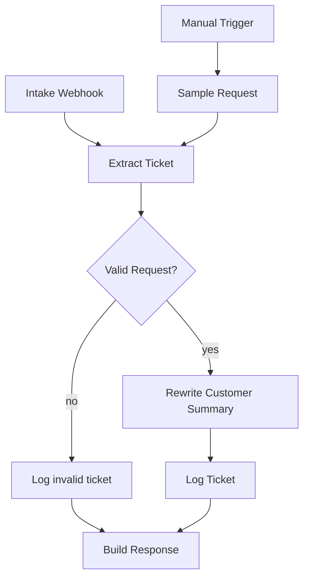

# n8n Project Intake Ticket

Public **fake-data** demo, separate from the [lead-response router](../demo-lead-response/). The workflow turns a messy free-text request into a structured ticket and a customer-facing summary. It does not send email. It is not a live client system.

**Workflow name:** `CKA Demo — Project Intake Ticket`
**File:** [`cka-project-intake.workflow.json`](cka-project-intake.workflow.json)
**Status:** Ships inactive. Import the JSON and test it yourself — there is no hosted demo URL.

## Resume one-liner

> Built an n8n project-intake workflow that turns messy free-text requests into structured tickets (title, priority, requester, category, due window, acceptance criteria) and rewrites a customer-facing summary in one step.

There is no hosted demo URL. Import the JSON, leave it inactive, then use the **Manual Trigger** or a local webhook-test listen. The localhost curl example below is the supported test path.

## Problem

Ops requests arrive as a pasted email or a messy webhook body. Someone still has to turn that into a ticket another person can work: a title, who asked, how urgent it is, what kind of work it is, when it is due, and what "done" means. The requester should see a short confirmation. The owner should see the internal codes.

## Architecture

Extraction and the customer rewrite are **rules**, in [`lib/ticket-rules.js`](lib/ticket-rules.js). There is no LLM node. The rewrite is **one Code node**, `Rewrite Customer Summary`. It does not call a second workflow.



### Fields

| Field | Rule |
| --- | --- |
| Requester | `from_name` / `from_email`, or a `From: Name <email>` line inside `text`. |
| Title | Subject, otherwise the first sentence, clipped to 90 characters. |
| Priority | `P1` for outage language (`urgent`, `is down`, `cannot log`, …). `P2` for `this week`, `soon`, `deadline`. Otherwise `P3`. |
| Category | First match: access, billing, onboarding, reporting, bug, otherwise `other`. |
| Due window | `today`, `this_week`, `this_month`, or `unspecified`. A `P1` with no day word is treated as `today`. |
| Acceptance criteria | Sentences containing must / should / need / done when / acceptance. If none, a fixed fallback sentence. |
| `summary_owner` | Internal one-liner: `[P1 \| access \| today] Title — email`. Written by the extract step. |
| `summary_customer` | One polite paragraph for the requester. Written only by `Rewrite Customer Summary`. Priority codes are not added. |

### Log store

Google Sheets, tab `Tickets`, spreadsheet placeholder `REPLACE_WITH_TICKETS_SPREADSHEET_ID`. Same credential **name** as the lead-response demo (`CKA Demo — Google Sheets`), separate spreadsheet id so this demo imports on its own. You can point both workflows at one spreadsheet with two tabs if you want; change the document id, not the tab name.

Header row: [`sheets/tickets-headers.csv`](sheets/tickets-headers.csv).

There is no `contacted` column. This demo does not send mail. `status` is `logged`, `invalid`, or `log_failed`.

## Node map

| Node | Role |
| --- | --- |
| Intake Webhook | `POST /cka-demo-project-intake`. |
| Manual Trigger → Sample Request | Runs `samples/access-outage.json`. |
| Extract Ticket | Structured fields and `summary_owner`. Does not write `summary_customer`. |
| Valid Request? | A missing requester email is logged as `invalid` and is not rewritten. |
| Rewrite Customer Summary | The only rewrite step. Adds `summary_customer`. |
| Log Ticket | Appends the rewritten row with `status=logged`. |
| Log Invalid Ticket | Appends the invalid row. No customer summary. |
| Stamp Logged / Stamp Invalid / Stamp Log Failed | Outcome for the HTTP body. A sheet error does not claim the ticket was logged. |
| Build Response → Webhook Call? | Webhook calls get a JSON body. Manual runs end at Manual Test Complete. |

## How to run

Rules only, from the repo root:

```bash
npm test
```

n8n:

1. Import [`cka-project-intake.workflow.json`](cka-project-intake.workflow.json). It stays inactive.
2. Create a sheet tab named `Tickets` and paste [`sheets/tickets-headers.csv`](sheets/tickets-headers.csv) into row 1.
3. Create a Google Sheets OAuth2 credential named `CKA Demo — Google Sheets` (the same name the lead-response demo uses).
4. Replace `REPLACE_WITH_TICKETS_SPREADSHEET_ID`, then re-select the credential. The id `REPLACE_WITH_GOOGLE_SHEETS_CREDENTIAL_ID` is a placeholder and will not bind on its own.
5. Execute **Manual Trigger**, or POST a sample:

```bash
curl -X POST 'http://localhost:5678/webhook-test/cka-demo-project-intake' \
  -H 'Content-Type: application/json' \
  --data-binary @demo-project-intake/samples/access-outage.json
```

Accepted shapes:

```json
{
  "from_name": "Priya Shah",
  "from_email": "priya.shah@example.com",
  "subject": "Q3 pipeline dashboard is wrong",
  "body": "We need this week. Done when the AE view matches the stage totals."
}
```

```json
{
  "text": "From: Alex Kim <alex.kim@example.com>\nSubject: Can't log in\n\nUrgent — SSO is down. Need access restored today."
}
```

To try an LLM later, replace **only** `Rewrite Customer Summary` with one OpenAI (or other) chat node. Keep the extract rules. A usable prompt:

```text
Rewrite this internal ticket for the customer. Do not include priority codes.
Return one short paragraph.
Title: {{title}}
Category: {{category}}
Due: {{due_window}}
Acceptance: {{acceptance_criteria}}
Requester: {{requester_name}}
```

Use an n8n credential named `CKA Demo — OpenAI` if you add that node. This repo does not include the node or a key.

## Sample payloads

| File | Priority | Category | Due window |
| --- | --- | --- | --- |
| `samples/access-outage.json` | P1 | access | today |
| `samples/reporting-request.json` | P2 | reporting | this_week |
| `samples/billing-refund.json` | P3 | billing | this_month |
| `samples/bug-import.json` | P2 | bug | this_week |
| `samples/vague.json` | P3 | other | unspecified, fallback acceptance line |
| `samples/invalid-no-email.json` | — | — | invalid, nothing rewritten |

The manual trigger uses the access-outage sample, which is a pasted email rather than clean fields.

## Loom outline

- Show the inactive workflow and say it is a separate demo from lead response.
- Execute the manual trigger on `samples/access-outage.json`.
- Open `Extract Ticket` and show priority, category, due window, and the owner one-liner.
- Open `Rewrite Customer Summary` and show the customer paragraph has no `[P1]` prefix.
- Show the Tickets header row the append node expects.
- Mention the single-node swap if a reviewer wants a model in that step.

## Redaction

- No live inboxes, spreadsheet ids, webhook secrets, or API keys.
- Requesters in `samples/` use `@example.com` only.
- `REPLACE_WITH_TICKETS_SPREADSHEET_ID` and `REPLACE_WITH_GOOGLE_SHEETS_CREDENTIAL_ID` are placeholders.
- Keep the workflow inactive for local testing. Before any real exposure, add webhook authentication and replace the placeholders.
